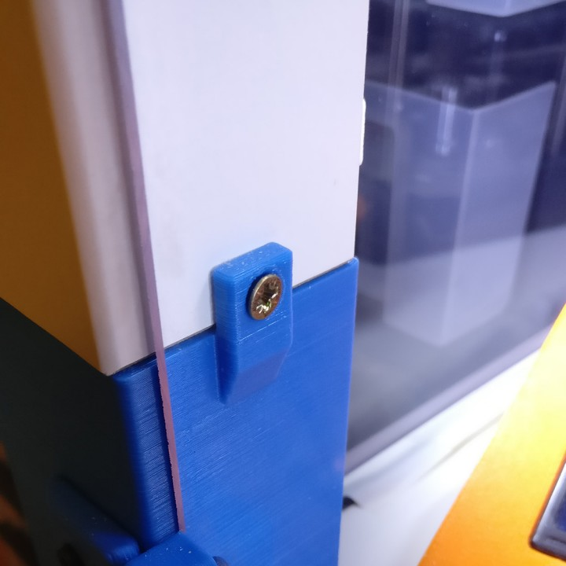
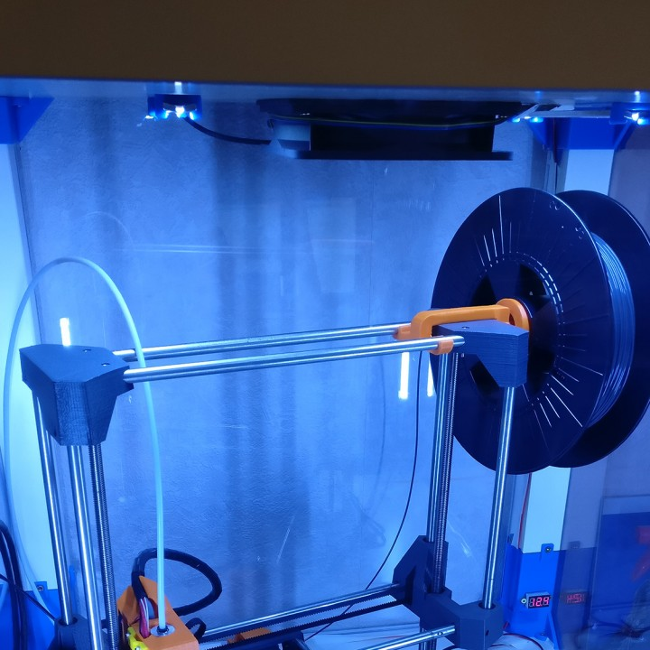
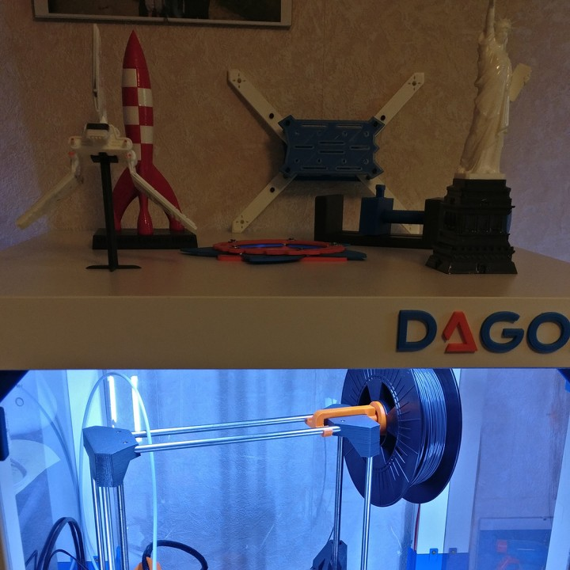
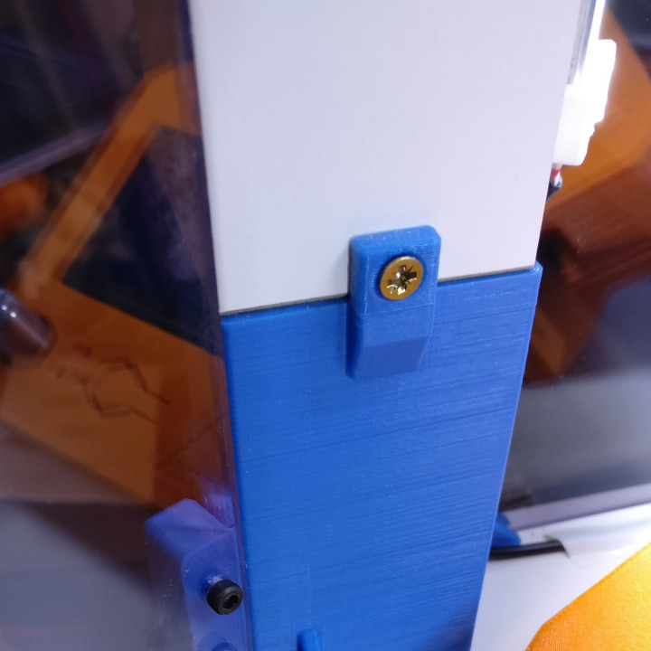
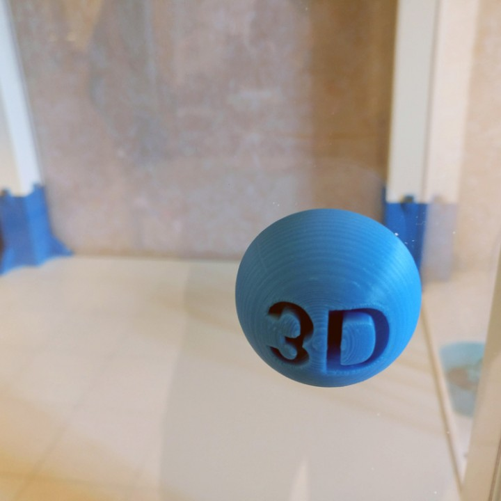
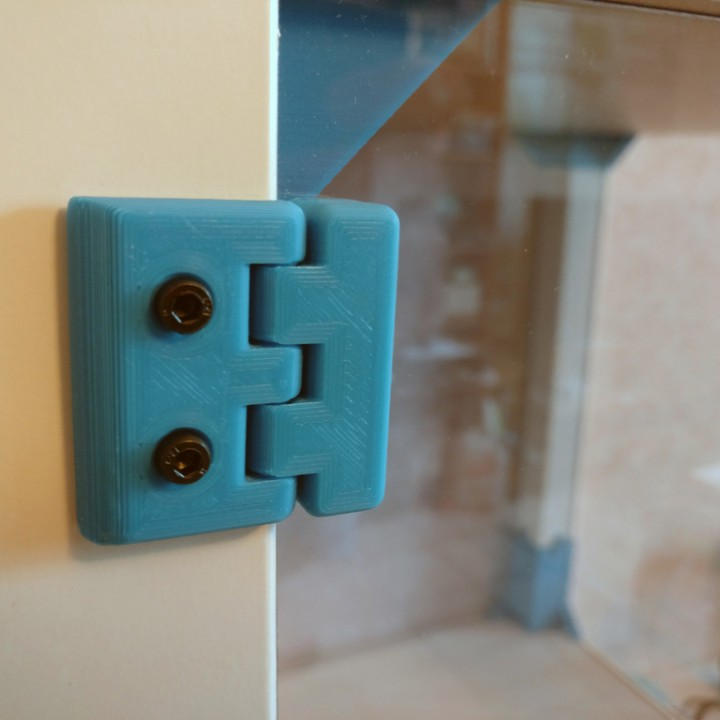

# Prusa Lack

[Proyecto de armario para i3 hecho con una mesa Lack de IKEA](https://www.myminifactory.com/object/3d-printer-case-with-lack-tables-ikea-41729)

Diseñado por [Eric FLAMMIN](https://www.myminifactory.com/users/Shoyun)

